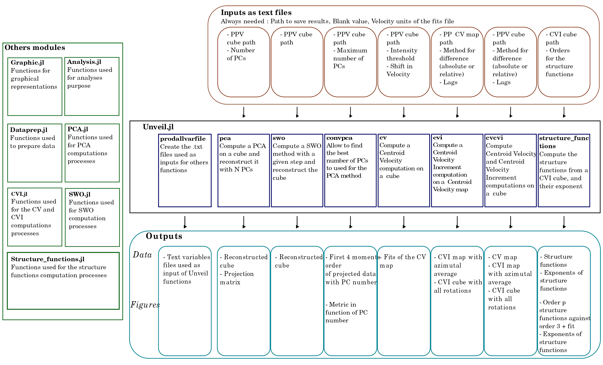

# Presentation 
This code unveil positions of extreme intermittent dissipation of turbulence on PPV cubes obtained by observing molecular gas inside molecular clouds. It uses statistical analysis by computing Centroid Velocity Increments, based on Lis et al. 1996, Pety et al. 1999, Hily-Blant et al. 2007, Hily-Blant et al. 2008, Hily-Blant et al. 2009, and on the PhD thesis of Simon Delcamp (in prep). 

One of the original features of the Unveil.jl analysis code is its ability to estimate uncertainties in statistical markers. On the one hand, Unveil.jl provides two independent methods of data treatment: the Spectral Window Optimisation (SWO), inspired by the work of Pety+2003, and a data compression using Principal Component Analysis (PCA). These two methods were tested on numerical simulations in order to calibrate the parameters of use, providing strong recommendations on the SNR required for observations. The code's ability to measure the statistical properties of turbulence was tested on magnetohydrodynamic numerical simulations covering sub- to supersonic and sub- to superAlfvénic regimes.

The idea is to give quick and simple tools to interested researchers, written in a new, promising and well maintain programming language for him to evolve. 

The module **Unveil.jl** is the main one. It contains 8 functions, each one comunicating with others modules inside this package. To be able to use one function of **Unveil**, you should first produce a '.txt' variable file. This allow to use functions with high numbers or long inputs more easily and quickier. Examples of these .txt files can be produced with the function Unveil.prodvarfile().




## Statistical analysis
The statistical analysis is based on the computation of the Centroid Velocity, and the Centroid Velocity Increment. On a PPV (Position-Position-Velocity) cube, the centroid velocity is writen as :

  $$  C \ \text{[km/s]} = \frac{\sum_{i=1}^{N_v} T(v_i) \times v_i \ \delta v}{\sum_{i=1}^{N_v} T(v_i) \ \delta v}$$

Then, we compute the Centroid Velocity Increment by using a lag noted $l$ :
$$\Delta C(l) = |C(\textbf{r}+l)-C(\textbf{r}) |$$
This computation is made on every pixels of the map. For a given pixel, we compute this for multiple angles around it : the lag is just a distance, not a direction. If only the positions for high intermittent dissipation of turbulence are needed, we do the average for a given pixel. Else, for the statistical analysis, every values are needed. 

However, the centroid velocity computations is very dependant to the noise of the spectra we are working with. Two methods of data pre-treatment are proposed with this code to limit the uncertainties :
1. A Principal Component Analysis (PCA)
2. A Spectral Window Optimisation (SWO)

**PCA** \
The reader should be comfortable with the notions of **Principal Components Analysis** and the **Data Reconstruction with PCA**. For reference, see for example Kendall (1957), Jeffer (1967). A more detailled description can be found in Delcamp PhD's thesis (2023) (in French). In our code, the idea is to use PCA to enhance the signal-to-noise ratio of our spectra without removing the signals. Its a compression mecanism, where we only use the variance associated to signal, and remove all variance associated to noise. This procedure is based on the fact that each PC add a part of the variance of the data. Thus, the signal count for the highest variance, and the noise for the lowest variance. 

The main concern with the use of this code is to decide how many PCs should be used. To do so, we suggest the use of a metric based on the first 4 moments orders of the data projected on each PC. Indeed, the projection of a noise-only data cube on every PC will give a Gaussian, while a noise-free cube will give non-Gaussian distributions. For a cube with noise and signal, projection on the first PCs will give non-Gaussian distribution, ressembling to a Gaussian when we enhance the number of PCs. The metric then computed is as follow :
  $$  m_\text{PCA} =  \sqrt{\left(\mu_\text{PCA}\right)^2 + \left(\sigma_\text{PCA}\right)^2+\gamma_\text{PCA}^2+(\kappa_\text{PCA}-3)^2}$$


**SWO** \
The idea behind this method is to reduce the size of the spectra by removing the noise channels, in other words to search the window containing only the signal. It's a modification of the method presented in Pety+2003. In Unveil.jl, the code will search a window $m$ where this term is maximised :

 $$ WO = \frac{\sum_{i=p}^{p+m-1} T_i}{\sqrt{m\sigma_m}} $$

Where $\sigma_m$ is the second moment order of the intensity in the velocity interval considered, $T_i$ the intensity in the channel $i$.

<!--- This method compute intensity integration of each spectra over a given number of channels (to smooth the intensity). For each new bigger channel, we compute the differences with the precedent one. At the end, we are going from noise onyl to signal part of a spectra when this result is close to $$\sigma_T^2 dv N_\text{T}$$  
with $\sigma_\text{T}$ being the dispersion of the noise, $dv$ the step for integration and $N_\text{T}$ the number of noise channels. However, this computation depends strongly on the step used for the integrations.

It can be demonstrate that if we compute the intensity integration of the original spectra and of the spectra reproduced by this method, if the method is working perfectly, their differences should be equal to an integration of a noise part of the spectra only. Thus, the first 4 moments orders should caracterise a Gaussian with a dispersion equal to the noise dispersion. Then, the given metric is the smallest possible when the method works the best :

$$   m_\text{OLS} =  \sqrt{\left(\frac{\mu_I^{N_T}}{\delta vdI}\right)^2 + \left(\frac{\sigma_I^{N_T}-\sigma_\text{b}}{\delta vdI}\right)^2+\gamma_I^2+(\kappa_I-3)^2} $$ --->

# Where is the doc ?
The doc is in a form of html pages. You can find them in the folder 'docs/build'. Clone them and open them.

# Installation
This package is not registered in the General registry of Julia following the recommended practices. It is clear that the functionalities of this package will mainly by used by a small group of researchers. 

However, the package installation is still simple. While in the local directory where you want to install it, two commands are needed : inside Julia, type :

```
julia> using Pkg
julia> Pkg.add(url="https://gricad-gitlab.univ-grenoble-alpes.fr/delcamps/unveil")
```
## KNOWN PROBLEMS
If there is an issue during precompilation with GR_jll, follow the solution found in this website : 
https://discourse.julialang.org/t/plots-initerror-undefvarerror-gr-jll-not-defined/102448/2

<!---The second command will ask you to enter your Username and your Password. For the Username, just enter the one you are using to connect to gitlab (email adress probably). For the Password, you need a "Project Access Tokens". 

*Project Access Tokens* :
Go to the project directory, into Settings then Access Tokens. Here, enter a Token name, remove the expiration date, select a role, check the box "api", and click on create. A new project access token will be prompt above : **save it inside your local computer, it will nether be prompt again !**

After that, everything inside the gitlab repo will be saved in the directory you are working in. --->


# Recommandations and rules
## Rules
To be used correctly, few rules should be followed : 
1. All files should be **.fits**
2. For better results, it is highly recommanded to blank the maps edges, and/or the noisiest spectra. 
3. For a PPV (Position-Position-Velocity) cube, at one given position in PP space, if one velocity channel is blanked, it should be blanked on every others velocity channels. We call that *regular blanking*. If not, the code will throw an error. 
4. The fits header should contain usual entries. See [this list of keywords definition](https://heasarc.gsfc.nasa.gov/docs/fcg/standard_dict.html) of the fits file convention for more informations. As far as we know, using the software GILDAS(https://www.iram.fr/IRAMFR/GILDAS/) to convert from 'fits' to 'lmv' and then from 'lmv' into 'fits' works. The necessary parameters 'DATAMIN', 'DATAMAX', 'CTYPE1', 'CRVAL1', 'CDELT1', 'CRPIX1' and 'CROTA1' (with every numbers given above going from 1 to 3).


## Recommandations
For faster execution on the first plot and on the compilation of Unveil, we recommand to do a sysimage using package PackageCompiler.jl. A sysimage is specific to the computer, thus follow these steps to do it. 
- After installation, run julia in a terminal and install PackageCompiler.jl  : 
```
julia> using Pkg
julia> Pkg.add("PackageCompiler.jl")
```
- You can now use PackageCompiler:
```
julia> using PackageCompiler
julia> PackageCompiler.create_sysimage(["Unveil"]; sysimage_path="PATH/SYSIMAGE.so")
```
The last command need to give a path where the sysimage will be stored. It took around 3m on my computer. 

Then, next time you want to run Julia in a terminal, type :
```
julia --sysimage PATH/SYSIMAGE.so
```
You can also create an alias for julia on your .bashrc.


# Running it


First, in julia, enter : 
```
julia> using Unveil
```

From that, every functions of the package can be used. The first function to use is :
```
julia> Unveil.prodvarfile()
```
It will create all .txt variable files needed to run the other functions. Each function has an associated .txt file where variables are indicated (e.g fits path, values of the lags, ...).  They are used by given these modified txt files as input. For example you want to produce a PCA, just enter :
```
julia> Unveil.pca('path-to-the-txt-file')
```


Numerous others functions of this package can be used. They are inside others modules and should be used accordingly. For example, you can change every "NaN" positions to a given one in a PPV cube : 
```
julia> cube = Unveil.Data_preparation.read_fits_ppv(path,vel_units)[1]   # Read the fits inside 'path'. Need the unit of the veloity dimension
julia> Unveil.Data_preparation.replace_nantoblank(cube,newvalue)   # Change all NaN inside 'cube' into 'newvalue'
```

For a list and description of every function, please see the doc : download the folder 'docs/build' and open the '.html' files inside it. 


